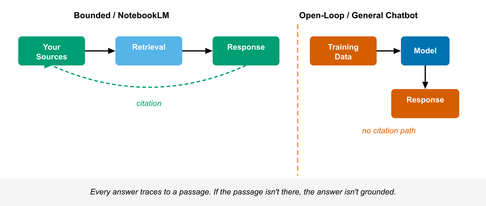

# Chapter 1 — The Bounded Tool
*What the boundary is, why it exists, and what it buys you.*

---

Most AI tools answer from everything they know. NotebookLM answers only from what you give it. That single difference changes every prediction you make about how the tool behaves.

If you understand the boundary, the rest of the tool is predictable. If you don't, you will keep being surprised in ways that erode your trust in the output — and trust you can't calibrate is useless.

---

## What a General Chatbot Is Actually Doing

A general-purpose language model — ChatGPT, Claude, Gemini in its standard form — was trained on a massive corpus: books, websites, papers, forums, code. During training it learned statistical patterns across that corpus. Those patterns compressed into billions of numerical weights. The model doesn't store facts the way a database stores records. It stores tendencies — likelihoods, associations, patterns of language. When you ask it a question, it generates a response by running those likelihoods forward, predicting token by token what a plausible answer looks like.

This is why general chatbots are fluent. The pattern-matching is extraordinary. It is also why they hallucinate. Hallucination isn't a bug in the colloquial sense — it's what happens when the probability distributions point confidently toward something that isn't true. The model produces a well-formed sentence that happens to be wrong, and it has no internal mechanism to catch that wrongness. It has only the patterns.

The practical consequence: when you ask a general chatbot to work with a specific document, it uses that document as context that shapes the probability distributions. The output looks like it's from the document. Often it largely is. But the model can still drift — softening qualifications the author was careful to make, inventing a figure that plausibly belongs in that section, dropping the hedge that made a contested claim conditional. The error is invisible. The output reads like the document. You'd have to check line by line to know.

There's no citation. There's nowhere to check. That's the structure of the problem.

---

## What NotebookLM Is Actually Doing

The architecture is different in a way that matters.

When you ask NotebookLM a question, the system first searches your uploaded documents for passages relevant to that question. This is a real retrieval step — a semantic search across your source set that returns the chunks of text best matching your query. Those retrieved passages get passed to the language model alongside your question. The model's job is narrower: answer this question using these passages. The system tracks which passage backed which part of the answer and produces inline citations — numbered markers linking back to specific locations in your sources.

This is called Retrieval-Augmented Generation, or RAG. NotebookLM is Google's consumer implementation, running on a Gemini variant called LearnLM. The architecture is the important part, not the brand name.

<!-- → [FIGURE: Bounded vs. open-loop architecture — left: uploaded sources → retrieval → model → grounded response with citation arrow back to source; right: training data → model → response, no citation path. Caption: Every answer traces to a passage. If the passage isn't there, the answer isn't grounded.] -->

*Every answer traces to a passage. If the passage isn't there, the answer isn't grounded.*

Three things change under this architecture.

**The answer is bounded by your sources.** The model can only draw from what you uploaded. If something isn't in your sources, it's not in the answer — the system tells you it can't find a relevant passage rather than inventing one. This is the feature. It also means the quality of your source set is the highest-leverage variable in the whole workflow. Bad sources produce bad output, fluently.

**Every claim is auditable.** The citation is an audit trail. Click a citation marker and the source pane jumps to the passage the claim came from. You can read whether the underlying text actually supports what the response said. This doesn't mean the response is correct — it means you can check it, immediately, without going anywhere else.

**A specific class of error becomes visible.** A general chatbot can state something not in any source because it isn't working from sources. NotebookLM can't produce a citation to a passage that says something the passage doesn't say — the passage is there, readable by you. Fabrication becomes structurally harder. In its place, you get interpretation errors: the passage is real, but the model paraphrased it in a way that flattened a qualification or dropped a hedge. Visible errors can be caught. That's the trade.

---

## What the Boundary Costs You

The boundary is the product. It is also a real constraint.

If your question requires knowledge that isn't in your sources, you get nothing useful. The system will tell you it can't find relevant information, or it will answer from whatever thin evidence exists in the corpus — which you need to recognize and reject. The tool does not supplement your sources with general knowledge. It doesn't know what you know. It only knows what you gave it.

This means the tool is wrong for certain tasks. Open-ended synthesis across a broad domain you haven't pre-loaded — wrong tool. Creative generation that requires drawing on wide context — wrong tool. Quick factual lookups when you don't have a relevant document ready — wrong tool. Use a general chatbot for those.

NotebookLM is built for a specific task: work deeply with a specific set of documents. Summarize them. Find what they say about a question. Identify contradictions between them. Produce structured outputs from them. Test your understanding against them. If that's what you need, the boundary is exactly what makes the tool useful. If that's not what you need, the boundary is just a frustration.

The most common mistake is treating the tool as a general assistant with some source-grounding bolted on. It isn't. The grounding is the whole design.

---

## When the Boundary Is the Point

There are specific professional situations where the boundary isn't a trade-off — it's the requirement.

**You need to cite your work.** A general chatbot response is difficult to source. You can quote it, but you can't point a reader to the underlying material that justifies the claim. NotebookLM gives you that link. Every output traces to a passage in a document you control.

**You need to audit someone else's output.** When a colleague or a vendor delivers a document-based analysis, you can load their sources into a notebook and check their claims directly. The citation tells you whether the underlying text actually supports the conclusion.

**You're working in a regulated or high-stakes environment.** Legal research, clinical documentation, policy analysis, compliance work — any context where "the AI said so" is not defensible. NotebookLM doesn't change the underlying liability, but it gives you an explicit chain from claim to source that a general chatbot doesn't.

**You need to get up to speed on an unfamiliar corpus fast.** A general chatbot can summarize a topic from training data. That's useful when you don't have specific documents. When you have the documents and need to extract from them accurately — not from what the model vaguely recalls about the domain — the bounded architecture is the right tool.

**You need reproducibility.** The same sources, asked the same question, should produce answers in the same direction. General chatbots vary more by session. Source-grounded systems are more stable because the retrieval step constrains the generation.

---

## The Verification Discipline

The boundary creates one thing that general chatbots don't: a built-in verification step.

With a general chatbot, there's no obvious place to check the output. The response arrives fluent and confident. To verify it, you'd have to locate the sources yourself — which is exactly the work you were hoping to avoid. Most people don't check. They act on the output, cite it, or pass it along, trusting the fluency.

With NotebookLM, the verification step is designed into the interface. The citation is there. Clicking it costs two seconds. Reading the passage costs thirty. That's the discipline: click the citation, read the passage, confirm the claim matches what the passage actually says.

The citation does not mean the response is correct. It means the response is checkable. Those are different things, and the difference matters.

The most common way NotebookLM fails in practice is that users treat citation markers as credentials — small green lights meaning "this is right" — rather than as links meaning "here is where you check." The citation is the start of verification, not the end of it. A response can cite a real passage and still misrepresent it. The model paraphrases. It simplifies. It occasionally drops the conditional that made a claim true only in specific circumstances. You catch that by reading the passage, not by seeing that a citation exists.

Build the habit: every time you're going to act on a NotebookLM output — use it in a document, share it, make a decision based on it — click the citations. Read the passages. Confirm the claims. The tool makes this possible. Whether you do it is the only variable left.

---

## What This Means in Practice

The bounded architecture is not a safety guarantee. It's a structural property that changes where errors come from and whether you can catch them.

General chatbots produce two error types in roughly equal measure: fabrication (the model invented something) and misinterpretation (the model misread something that was there). NotebookLM nearly eliminates fabrication — there's nothing to invent from, so the model is forced to work with what you gave it — but leaves misinterpretation intact. A 2025 comparative study found fabrication rates of roughly 40% in open-loop systems and 13% in source-grounded systems against the same corpus. The 13% isn't zero. It's the misinterpretation floor.

The practical implication: your job with NotebookLM is not to trust or distrust the output globally. It's to read the cited passages and decide, claim by claim, whether the model's version of what the source says is accurate. That's a different cognitive task than working with a general chatbot. It's more tractable because you have somewhere to look.

Use the boundary. Click the citations. Read the passages. Everything else in this book assumes you're doing that.

---

## Worked Exercises

**Exercise 1 — The same question, two tools**

1. Choose a document you know well — a research paper, a report, a contract, anything with specific factual content.
2. Upload it to NotebookLM. Create a new notebook with only this document as a source.
3. Ask a specific factual question — something with a precise answer in the document. Note the response and whether it includes a citation.
4. Click the citation. Read the passage. Confirm whether the response accurately represents what the passage says.
5. Ask the same question to a general chatbot (ChatGPT, Claude, or Gemini without your document attached). Note the response.
6. Compare: Does the general chatbot's response cite a specific passage? Could you verify its answer without going to find the document yourself?
7. Now ask both tools about something you know is *not* in the document. Note what each does. NotebookLM should tell you it can't find relevant information. The general chatbot may answer confidently from training data — or may hallucinate.

**Expected output:** A clear sense of what "grounded" means in practice — what citation buys you and what it doesn't. You should have at least one example of NotebookLM's response that you verified against the source passage, and one example of what the tool does when the answer isn't in its sources.
