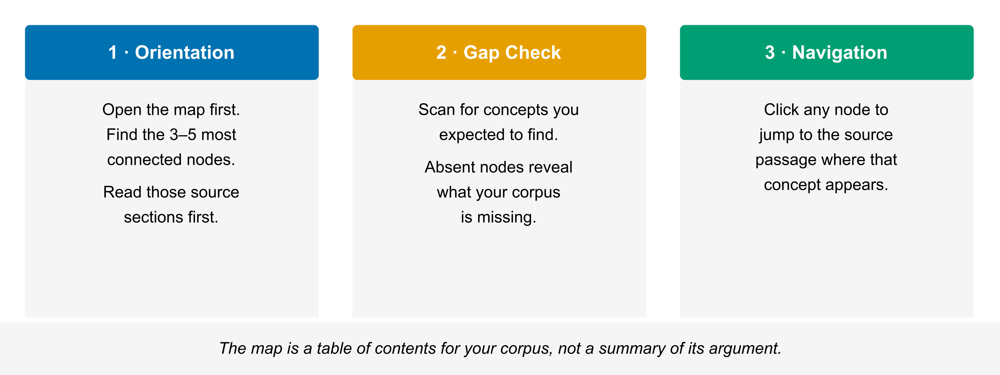

# Chapter 5 — Mind Map
*The visual layer: what it shows, what it doesn't, and when a map is more useful than text.*

---

## What NotebookLM's Mind Map Actually Generates

The Mind Map is a topology diagram. Nodes are key concepts extracted from your sources. Edges are relationships the model identified between those concepts — co-occurrence, explicit linkage in the text, or semantic proximity. Layout is auto-generated; you cannot reposition nodes manually.

Each node is clickable. Click a node and NotebookLM takes you to the relevant source passage or passages where that concept appears. That click-through is the map's most practical feature.

The map does not represent argument structure. It does not rank claims by importance. It does not reproduce the author's intended hierarchy or distinguish between a central thesis and a passing mention. A concept that appears once in a footnote may show up as a node. A concept that runs through the entire argument may or may not appear more prominently. The map reflects what is present in the text and how often concepts appear together — not what the corpus is arguing.

---

## What It Does Well

**Rapid orientation.** If you are working with an unfamiliar corpus — a new research domain, a set of documents from a client, a literature review you inherited — the Mind Map tells you what concepts are present before you have read anything. You can see the terrain. That is genuinely useful when you do not know what you are looking for yet.

**Unexpected concepts.** Because the model extracts concepts you did not specify, the map sometimes surfaces terms you would not have searched for. A policy document loaded to study economic effects may have a cluster around regulatory enforcement that you had not flagged as relevant. The map shows it. You might not have found it by reading linearly.

**Density reading.** Nodes with more connections are central in the corpus — they connect to more other concepts. Peripheral nodes connect to fewer. This tells you where the material is dense and where it is sparse. Dense nodes are usually worth reading first.

**Navigation.** For a large corpus, clicking through the map is faster than scrolling. If you see a node for a concept you need, click it. You land in the passage. No search string required.

---

## What It Does Not Do

The Mind Map does not show you what the corpus argues. It shows you what the corpus contains.

Those are different things. An argument has direction: premises lead to conclusions, evidence supports or undermines claims, one position responds to another. A topology diagram has none of that. The edges in the Mind Map mean "these concepts appear together" — not "this supports that" or "this contradicts that."

Do not use the Mind Map to understand the structure of an argument. Use Chat for that. Ask: "What is the central claim of this corpus? What evidence does it offer? What are the main objections the sources engage with?" Those are questions the map cannot answer and Chat can.

The map also does not tell you which claims are important. A concept that appears often is not necessarily the core claim. A claim that appears once may be the one everything else depends on. The map has no way to make that distinction.

<!-- → [FIGURE: Mind Map use cases — three-panel: (1) orientation pass: start with the map, identify the 3–5 central nodes, then read those sections first; (2) gap check: look for concepts you expected to see that are absent; (3) navigation: click a node to jump to the source passage. Caption: The map is a table of contents for your corpus, not a summary of its argument.] -->

*The map is a table of contents for your corpus, not a summary of its argument.*

---

## How to Use It

**First-pass orientation.** Before you read anything, generate the map. Identify 3–5 nodes with the most connections. Click each one. Skim the source passages those nodes link to. Now you have a rough sense of what the corpus centers on before you have committed reading time.

**Gap identification.** Look for concepts that should be in your corpus but are not appearing as nodes. If you loaded a set of documents on machine learning fairness and you do not see a node for "disparate impact," that absence is information. Either the corpus does not engage with that framing — or it uses different terminology and you need to search for it.

Absent nodes are not always gaps. Sometimes the concept is present under a different label. Sometimes it is genuinely absent, and that is a meaningful finding about what your corpus does and does not address.

**Navigation.** Once you know roughly what you are looking for, the map is faster than search for some queries. Click the relevant node. Land in the passage. Evaluate whether it is what you need.

---

## Limits

**Large corpora produce clutter.** A notebook with 20 or 30 sources will generate a dense map with many nodes and edges. At that scale the map becomes harder to read quickly. Use it for orientation anyway — identify the major clusters — but do not expect a clean visual.

**Node granularity varies.** The model sometimes produces nodes that are too fine-grained ("randomized controlled trial" and "RCT" as separate nodes) or too coarse ("methodology" as a single node covering several distinct approaches). This is a parsing artifact. Work with it rather than against it — if a node is too coarse, click through and read the passages to understand what is actually grouped there.

**The map changes when you add sources.** Add three new documents and regenerate. The map may look substantially different. Nodes appear and disappear. This is not a bug — it reflects the expanded corpus — but it means the map is a snapshot, not a stable artifact. Do not build a workflow that depends on a specific map configuration remaining fixed.

---

## Worked Exercises

1. Load 3–5 related documents into a notebook. Generate the **Mind Map**. Before clicking anything, write down the three nodes that appear to have the most connections. These are your candidate central concepts.

2. Click each of the three central nodes. For each one, note: what source passage does it take you to? Does that passage confirm that the concept is genuinely central to the corpus, or is the map's centrality ranking misleading?

3. Look at the full map. Identify one concept you expected to find in this corpus that does not appear as a node. Ask yourself: Is the concept absent from the sources, or is it present under a different label? Use **Chat** to ask: "Does the corpus engage with [missing concept]?" Compare the Chat answer to what the map showed you.

---
