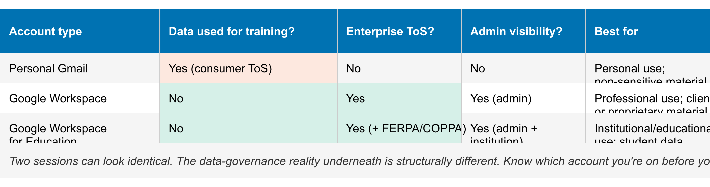

# Chapter 9 — Sharing, Collaboration, and Account Types
*What you can share, with whom, and why the account type matters more than it looks.*

---

## Sharing

Every notebook has a **Share** button. Clicking it gives you two options: a view-only share link, or an invitation to a named collaborator with editing rights.

**View-only link.** Anyone with the link can open the notebook and query it — ask questions in the chat, get answers, read the outputs. What they cannot do: add or remove sources, create or view your Notes (unless you've promoted a Note to a source, in which case it's part of the corpus and visible), change any settings, or generate saved outputs on your behalf. The viewer gets a read-only query interface over your corpus.

This is useful for sharing a research base with colleagues who need to ask questions but shouldn't change anything. It's also useful for sharing with a client or stakeholder who needs access to the material but not control.

**Full collaboration.** Invite a specific Google account as a collaborator. That person can add sources, create Notes, generate outputs, and change notebook settings. They have the same access you have.

To revoke access: return to **Share**, remove the collaborator's email or deactivate the share link. Changes take effect immediately. A viewer who had the link will get an access-denied screen on their next attempt.

---

## Collaboration Limits

Full collaboration is synchronous in the sense that two people can work in the same notebook at the same time. There is no merge-conflict mechanism — you are both working in the same state.

There is no version history for sources. If a collaborator adds a source, it's there. If they delete one, it's gone. There is no undo, no restore, no diff. If your collaboration involves any source that you cannot easily re-obtain — a document you worked to collect, a file that isn't easily re-uploaded — do not rely on notebook history to protect it. Keep your own copy.

The same applies to Notes. A collaborator can edit or delete Notes. If a Note is important, copy its content somewhere outside the notebook before you share editing access.

These are not obscure edge cases. They are the first things that go wrong when teams start using shared notebooks without knowing the limits.

---

## Account Types

The surface is identical across account types. You open NotebookLM, upload sources, query them, generate outputs. The interface does not tell you which account type you're on. Nothing in the UI changes.

What changes is what happens to your data underneath. This is the part that matters if you're putting anything sensitive into the notebook.

**Personal Gmail.** Google's consumer terms of service govern the session. Those terms permit Google to use your data — your queries, your sources, your outputs — to train and improve its models. There is an opt-out. Most users don't know it exists. If you're on a personal Gmail account and you haven't explicitly opted out, assume your data is in scope for training use.

**Google Workspace (standard).** Enterprise terms of service apply. Google does not use your data for model training. Your administrator has visibility into what data is being processed and under what terms. This is the baseline for professional use of any regulated or client-related material.

**Google Workspace for Education.** Additional protections beyond standard Workspace: FERPA and COPPA compliance are built into the terms. Student data rules apply. This is the appropriate account type for educational institutions handling student-adjacent material. It is not interchangeable with standard Workspace — they have different compliance obligations and different administrator controls.

<!-- → [TABLE: Account type comparison — columns: Account type, Data used for training?, Enterprise ToS?, Admin visibility?, Best for. Rows: Personal Gmail / Google Workspace / Google Workspace for Education.] -->

*Two sessions can look identical. The data-governance reality underneath is structurally different. Know which account you're on before you add sensitive material.*

---

## When Account Type Matters

The account type question is not abstract. It is the first thing to settle before you load any of the following into a notebook:

**Client material.** If it belongs to a client, they likely have expectations about where it goes. Consumer cloud services are not typically within those expectations. Use a Workspace account.

**Regulated data.** Health information (HIPAA), legal communications with privilege implications, financial information under fiduciary obligations — none of these belong in a personal Gmail session. A standard Workspace account addresses the training-data concern. It does not satisfy HIPAA or other domain-specific regulatory requirements, which may require additional contractual arrangements with Google. Verify what your specific regulatory context actually requires.

**Institutional material.** Anything that belongs to your employer rather than to you personally — internal strategy documents, personnel information, proprietary research — should not be going into a personal Gmail account. If your institution has Workspace, use it.

**Contested or confidential research.** Unpublished findings, grant proposals, pre-publication manuscripts — if it has competitive or confidentiality value, the personal-Gmail training-data pipeline is the wrong place for it.

The practical rule is simple: if you would not paste the content into a public forum, use a Workspace account, not a personal Gmail. That is not a complete security analysis. It is a working heuristic that catches the most common mistake.

---

## The Structural Difference You Can't See

Two people can run the same NotebookLM session — same sources, same queries, same outputs — and be operating under completely different data-governance regimes. One is on personal Gmail. One is on Workspace. The interface gives no indication of which is which.

This is the part that catches people. The experience is identical. You cannot look at the screen and determine which account type is active. You have to know, separately, which account you signed in with.

In practice: many professionals maintain both a personal Gmail account and a Workspace account. They use NotebookLM on whichever one they happened to be signed into. The account type wasn't a deliberate choice — it was a default. That default has governance consequences they're not aware of.

The mitigation is not complicated. Know which account you're on. Make it a deliberate choice before you load sensitive material, not a retroactive discovery after you've already loaded it.

---

## Checking Your Account Type

You can verify which account you're using:

1. Open **Google Account settings** (click your profile picture, then **Manage your Google Account**).
2. Look at the email address. A Workspace account typically uses a custom domain (your organization's email). A personal Gmail account uses @gmail.com.
3. In Account settings, look for the account type label. Workspace accounts show organizational branding and administrator contact information that personal accounts do not.

If you're unsure, the most reliable check is the email domain. If it's @gmail.com, it's a personal account. If it's your employer's or institution's domain, it's a Workspace account — though you should still verify with your IT department what policies and configurations are in place.

---

## Worked Exercises

1. Open an existing notebook and click **Share**. Create a view-only share link. Open it in an incognito window. Attempt each of the following and record what happens: (a) add a new source, (b) view any Notes in the panel, (c) change a notebook setting. Document exactly what a viewer can and cannot do — what interface elements appear, what actions are blocked, what error messages if any.

2. Check which account type you're currently signed into NotebookLM with. Go to **Google Account settings** and confirm the account type from the email domain and account information. Then ask yourself: do any of the notebooks you currently have open contain material you would not put in a public forum? If yes, and you're on a personal Gmail account, that's a decision you need to make explicitly — not one you want to discover accidentally.
