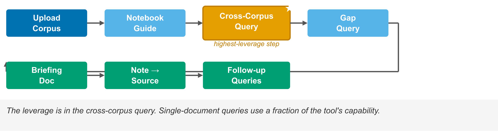

# Chapter 11 — Workflows
*How the features combine. Four workflows, step by step.*

---

Individual features are components. Workflows are what you actually do.

The four workflows below are complete sequences, in the order you execute them. Each step uses the output of the prior step. Work through the one that matches your current project.

One principle runs through all of them: the cross-corpus query is where the tool earns its keep. Single-document queries use a fraction of the capability. Querying across fifteen or forty sources simultaneously — finding where they agree, where they contradict, what they collectively leave unanswered — is the thing that would take a week by hand. Every workflow below is organized around getting you to that query.

---

## Workflow 1 — Research Synthesis

**Goal:** Understand a corpus of 10–40 papers or documents. Identify where they agree, where they contradict, and what they leave unanswered.

The bottleneck in literature review is not reading speed — it is holding forty papers' methodologies and findings in working memory simultaneously. You cannot do that. The model can. Your job is curation, verification, and the interpretive judgment about what the pattern means.

<!-- → [FIGURE: Research synthesis workflow — horizontal flow diagram: upload corpus → Notebook Guide orientation → cross-corpus query → gap query → Briefing Doc → Note promoted to source → follow-up queries with compound corpus. Caption: The leverage is the cross-corpus query. Single-document queries use 2% of the tool's capability.] -->

*The leverage is in the cross-corpus query. Single-document queries use a fraction of the tool's capability.*

**Steps:**

1. Upload the corpus. Aim for 15–40 sources. Before running queries, verify ingestion: for two or three sources, ask a specific factual question you know is answered in those documents. If the model cannot retrieve it, the source was not properly ingested. Catch this before building anything on it.

2. Generate the **Notebook Guide** and scan the suggested questions. Use them to calibrate whether your source set covers what you intended it to cover.

3. Run a cross-corpus query: "Across all uploaded papers, where do the methodologies disagree? Synthesize into a table with source citations." Vary the dimension — methodologies, findings, sample characteristics, frameworks — depending on your question. This is what you cannot do by reading one paper at a time.

4. Run a gap query: "What questions do these papers collectively leave unanswered?" Gap queries surface the most actionable research directions.

5. Generate a **Briefing Doc** to capture the synthesis. Save it.

6. Promote the Briefing Doc content to a **Note** — but rewrite it in your own interpretive language. Capture what you think the pattern means, which tensions are real versus terminological, which gaps matter for your question. Promote the Note to source. Your judgment is now in the corpus.

7. Run follow-up queries. The model now draws from the synthesized corpus and your interpretive synthesis together. The quality of your Note determines the quality of everything that follows.

**Verification rule:** After the cross-corpus synthesis table, verify every row against its cited sources. Expect to correct five to ten percent of attributions. The audit is not optional.

---

## Workflow 2 — Writing Support

**Goal:** Produce a well-structured first draft grounded in your source material.

The model sequences and cites; you write and judge. The output is a draft accurate to your sources.

**Steps:**

1. Upload your source documents: research, reports, prior drafts, reference material.

2. Generate an **Outline**. If it looks wrong — a section overweighted, a key topic missing — that is a signal about your source set. Adjust the sources before adjusting the structure.

3. For each major section of the Outline, run a targeted chat query: "Draft the [section name] section in 200 words. Cite the relevant passages." Run section by section, not the full draft at once — specific queries produce more accurate retrieval.

4. Paste the drafted sections into your writing environment and revise. The model's draft is a grounded starting point.

5. After drafting, generate a **Briefing Doc** as a fact-check pass. Compare it to your draft: where does your draft claim something the sources do not support? Correct before you publish.

6. For any claim you want to confirm, click its citation in the Briefing Doc and read the source passage.

**Common failure:** Drafting sections before the Outline is stable. Get the Outline right first.

---

## Workflow 3 — Document Review

**Goal:** Extract key information, commitments, and risks from a contract, report, or policy document.

The tool does not replace professional judgment. It shortens the extraction phase significantly.

**Steps:**

1. Upload the document. For multi-document reviews — a contract plus exhibits, a regulation plus guidance — upload all to the same notebook. Cross-document queries surface conflicts that single-document review misses.

2. Generate a **FAQ**. The questions surface what the document anticipates: what obligations it answers, what contingencies it addresses. Read this before running targeted queries.

3. Run a commitment query: "List every commitment or obligation this document places on [party]. Include section numbers." Run separate queries for each party if you need both sides.

4. Run a risk query: "What conditions, exceptions, or carve-outs limit the enforceability of the key commitments?" Risk queries surface the "provided that," "unless," and "subject to" language that makes absolute-sounding commitments contingent.

5. Generate a **Timeline** if the document contains dates, milestones, or deadlines.

6. Generate a **Briefing Doc** as your review summary and export it.

**Verification rule:** Spot-check obligation items against their cited sections. The model occasionally drops a qualifier. Any commitment you will act on or advise on requires a read of the underlying section.

---

## Workflow 4 — Knowledge Management

**Goal:** Build a persistent, growing notebook for a domain, project, or client. Accumulate understanding over time.

The first three workflows are project-bounded. This one is not. The notebook grows. Each new document, each new Note, each promoted synthesis adds to a corpus that becomes more useful over time.

**Steps:**

1. Create a notebook dedicated to the project, domain, or client. Name it something that will still make sense in eighteen months.

2. Upload foundational documents first: background material, prior work, reference standards. These are the corpus floor.

3. As you work, write **Notes** to capture what is not in the documents: observations, decisions, working assumptions, context that exists in your head or in conversations. Notes insert practitioner knowledge into the corpus. Without them, the notebook knows only what the documents say.

4. Promote key Notes to sources. Your accumulated judgment is now in the corpus and shapes every subsequent output.

5. Each time you add new documents, run the gap query: "What do the new sources add that wasn't covered in the prior corpus?" This surfaces the delta — what changed, not just what the full corpus contains. Use it to update your Notes when the new material changes your understanding.

6. Update Notes as understanding evolves. An outdated Note in the corpus is a liability — the model draws from it alongside current sources. Prune what is no longer true.

**The compounding effect.** A notebook maintained for six months contains more reliable, synthesized knowledge than any single document it holds. Most practitioners underuse this because they treat notebooks as project artifacts rather than knowledge assets.

---

## Worked Exercises

Choose one of the four workflows. Complete it end to end with a real corpus — documents from your actual work, not placeholders.

Work through every numbered step in sequence. Do not skip steps that seem obvious. The workflow's value is in the sequence.

When you finish, write one sentence: what would this have taken without the tool?

If you cannot write it — if the workflow did not save you anything meaningful — either the workflow was wrong for your task or your source set was too thin. Both are diagnosable. Identify where you short-circuited the steps and run it again with a denser corpus.
